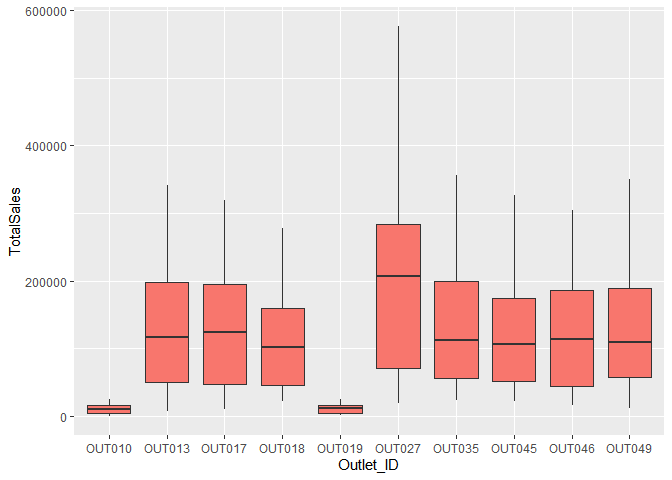

Mart Sales
================

``` r
library(rio)
library(formattable)
```

    ## Warning: package 'formattable' was built under R version 3.6.3

``` r
library(dplyr)
```

    ## 
    ## Attaching package: 'dplyr'

    ## The following objects are masked from 'package:stats':
    ## 
    ##     filter, lag

    ## The following objects are masked from 'package:base':
    ## 
    ##     intersect, setdiff, setequal, union

``` r
library(tidyverse)
```

    ## Warning: package 'tidyverse' was built under R version 3.6.3

    ## -- Attaching packages ---------------------------------- tidyverse 1.3.0 --

    ## v ggplot2 3.3.3     v purrr   0.3.4
    ## v tibble  3.0.6     v stringr 1.4.0
    ## v tidyr   1.1.2     v forcats 0.4.0
    ## v readr   1.3.1

    ## Warning: package 'ggplot2' was built under R version 3.6.3

    ## Warning: package 'tidyr' was built under R version 3.6.3

    ## Warning: package 'purrr' was built under R version 3.6.3

    ## -- Conflicts ------------------------------------- tidyverse_conflicts() --
    ## x dplyr::filter() masks stats::filter()
    ## x dplyr::lag()    masks stats::lag()

``` r
library(readxl)
library(corrplot)
```

    ## corrplot 0.84 loaded

``` r
library(stargazer)
```

    ## 
    ## Please cite as:

    ##  Hlavac, Marek (2018). stargazer: Well-Formatted Regression and Summary Statistics Tables.

    ##  R package version 5.2.2. https://CRAN.R-project.org/package=stargazer

``` r
library(car)
```

    ## Warning: package 'car' was built under R version 3.6.3

    ## Loading required package: carData

    ## Warning: package 'carData' was built under R version 3.6.3

    ## 
    ## Attaching package: 'car'

    ## The following object is masked from 'package:purrr':
    ## 
    ##     some

    ## The following object is masked from 'package:dplyr':
    ## 
    ##     recode

``` r
library(PerformanceAnalytics)
```

    ## Warning: package 'PerformanceAnalytics' was built under R version 3.6.3

    ## Loading required package: xts

    ## Loading required package: zoo

    ## 
    ## Attaching package: 'zoo'

    ## The following objects are masked from 'package:base':
    ## 
    ##     as.Date, as.Date.numeric

    ## Registered S3 method overwritten by 'xts':
    ##   method     from
    ##   as.zoo.xts zoo

    ## 
    ## Attaching package: 'xts'

    ## The following objects are masked from 'package:dplyr':
    ## 
    ##     first, last

    ## 
    ## Attaching package: 'PerformanceAnalytics'

    ## The following object is masked from 'package:graphics':
    ## 
    ##     legend

``` r
library(tidyr)
library(tm)
```

    ## Warning: package 'tm' was built under R version 3.6.3

    ## Loading required package: NLP

    ## Warning: package 'NLP' was built under R version 3.6.3

    ## 
    ## Attaching package: 'NLP'

    ## The following object is masked from 'package:ggplot2':
    ## 
    ##     annotate

``` r
library(MASS)
```

    ## 
    ## Attaching package: 'MASS'

    ## The following object is masked from 'package:dplyr':
    ## 
    ##     select

    ## The following object is masked from 'package:formattable':
    ## 
    ##     area

``` r
library(AER)
```

    ## Warning: package 'AER' was built under R version 3.6.3

    ## Loading required package: lmtest

    ## Loading required package: sandwich

    ## Loading required package: survival

    ## Warning: package 'survival' was built under R version 3.6.3

``` r
library(ggplot2)
library(lubridate)
```

    ## Warning: package 'lubridate' was built under R version 3.6.3

    ## 
    ## Attaching package: 'lubridate'

    ## The following objects are masked from 'package:base':
    ## 
    ##     date, intersect, setdiff, union

``` r
library(lattice)
library(lme4)
```

    ## Loading required package: Matrix

    ## 
    ## Attaching package: 'Matrix'

    ## The following objects are masked from 'package:tidyr':
    ## 
    ##     expand, pack, unpack

    ## Registered S3 methods overwritten by 'lme4':
    ##   method                          from
    ##   cooks.distance.influence.merMod car 
    ##   influence.merMod                car 
    ##   dfbeta.influence.merMod         car 
    ##   dfbetas.influence.merMod        car

    ## 
    ## Attaching package: 'lme4'

    ## The following object is masked from 'package:rio':
    ## 
    ##     factorize

``` r
library(MuMIn)
```

    ## Warning: package 'MuMIn' was built under R version 3.6.3

``` r
options(scipen = 999)
```

Importing Data

``` r
#importing data
df<-read_xlsx("BigMartSales.xlsx",sheet = "Data")
summary(df)
```

    ##    Item_ID           Item_Weight     Item_Fat_Content   Item_Visibility  
    ##  Length:8523        Min.   : 4.555   Length:8523        Min.   :0.00000  
    ##  Class :character   1st Qu.: 8.774   Class :character   1st Qu.:0.02699  
    ##  Mode  :character   Median :12.600   Mode  :character   Median :0.05393  
    ##                     Mean   :12.858                      Mean   :0.06613  
    ##                     3rd Qu.:16.850                      3rd Qu.:0.09459  
    ##                     Max.   :21.350                      Max.   :0.32839  
    ##                     NA's   :1463                                         
    ##   Item_Type            Item_MRP       Outlet_ID          Outlet_Year  
    ##  Length:8523        Min.   : 31.29   Length:8523        Min.   :1985  
    ##  Class :character   1st Qu.: 93.83   Class :character   1st Qu.:1987  
    ##  Mode  :character   Median :143.01   Mode  :character   Median :1999  
    ##                     Mean   :140.99                      Mean   :1998  
    ##                     3rd Qu.:185.64                      3rd Qu.:2004  
    ##                     Max.   :266.89                      Max.   :2009  
    ##                                                                       
    ##  Outlet_Size         City_Type         Outlet_Type       
    ##  Length:8523        Length:8523        Length:8523       
    ##  Class :character   Class :character   Class :character  
    ##  Mode  :character   Mode  :character   Mode  :character  
    ##                                                          
    ##                                                          
    ##                                                          
    ##                                                          
    ##    Item_Sales      
    ##  Min.   :   33.29  
    ##  1st Qu.:  834.25  
    ##  Median : 1794.33  
    ##  Mean   : 2181.29  
    ##  3rd Qu.: 3101.30  
    ##  Max.   :13086.97  
    ## 

``` r
colSums(is.na(df))  
```

    ##          Item_ID      Item_Weight Item_Fat_Content  Item_Visibility 
    ##                0             1463                0                0 
    ##        Item_Type         Item_MRP        Outlet_ID      Outlet_Year 
    ##                0                0                0                0 
    ##      Outlet_Size        City_Type      Outlet_Type       Item_Sales 
    ##             2410                0                0                0

Converting to factor and releveling

``` r
df$Outlet_ID<-as.factor(df$Outlet_ID)
df$Item_Fat_Content<-as.factor(df$Item_Fat_Content)
df$Item_Type<-as.factor(df$Item_Type)
df$Outlet_Size<-as.factor(df$Outlet_Size)
df$Outlet_Type<-as.factor(df$Outlet_Type)
df$City_Type<-as.factor(df$City_Type)
df$Age<-max(df$Outlet_Year)-df$Outlet_Year
```

Summing the Item sales based on item type

``` r
df2<-df %>% 
  group_by(Outlet_ID, Item_Type) %>%                        
  summarise(TotalSales = sum(Item_Sales))  
```

    ## `summarise()` has grouped output by 'Outlet_ID'. You can override using the `.groups` argument.

Merging Data Sets to create final data set with variables that are on
the item type level.

``` r
df3<-df[, c("Outlet_ID","Outlet_Year","City_Type","Outlet_Size","Outlet_Type","Age")]
df3<-unique(df3)
finaldf<-left_join(df2, df3, by ="Outlet_ID")
finaldf$TotalSales<-round(finaldf$TotalSales,digits=0)
```

Checking the distribution of the dependent variable

``` r
ggplot(finaldf, aes(x=finaldf$TotalSales)) + geom_histogram(color="coral",fill="coral")+ggtitle("Histogram of Total Sales")+xlab("Total Sales")
```

    ## `stat_bin()` using `bins = 30`. Pick better value with `binwidth`.

<!-- -->

``` r
ggplot(finaldf, aes(x=log(finaldf$TotalSales))) + geom_histogram(color="coral",fill="coral")+ggtitle("Histogram of Log Total Sales")+xlab("Log of Total Sales")
```

    ## `stat_bin()` using `bins = 30`. Pick better value with `binwidth`.

<!-- -->

``` r
ggplot(df, aes(x=log(df$Item_Sales))) + geom_histogram(color="coral",fill="coral")+ggtitle("Histogram of Log Total Sales")+xlab("Log of Total Sales")
```

    ## Warning: Use of `df$Item_Sales` is discouraged. Use `Item_Sales` instead.

    ## `stat_bin()` using `bins = 30`. Pick better value with `binwidth`.

<!-- -->

Checking how Total Sales vary by different factors

``` r
finaldf %>%
  group_by(City_Type) %>%
  ggplot()+
  geom_boxplot(aes(x=City_Type,y=TotalSales,fill="coral"))+
  guides(fill=FALSE)
```

<!-- -->

``` r
finaldf %>%
  group_by(Outlet_ID) %>%
  ggplot()+
  geom_boxplot(aes(x=Outlet_ID,y=TotalSales,fill="coral"))+
  guides(fill=FALSE)
```

<!-- -->

``` r
finaldf %>%
  group_by(Outlet_Type) %>%
  ggplot()+
  geom_boxplot(aes(x=Outlet_Type,y=TotalSales,fill="coral"))+
  guides(fill=FALSE)
```

<!-- -->

``` r
finaldf %>%
  group_by(Item_Type) %>%
  ggplot()+
  geom_boxplot(aes(x=Item_Type,y=TotalSales,fill="coral"))+
  theme(axis.text.x = element_text(angle = 50,hjust = 1))+
  guides(fill=FALSE)
```

<!-- -->

Running Models

``` r
reg<-lmer(formula = log(TotalSales)~Item_Type+City_Type+(1|Outlet_ID)+(1|Outlet_Type),data=finaldf)
summary(reg)
```

    ## Linear mixed model fit by REML ['lmerMod']
    ## Formula: log(TotalSales) ~ Item_Type + City_Type + (1 | Outlet_ID) + (1 |  
    ##     Outlet_Type)
    ##    Data: finaldf
    ## 
    ## REML criterion at convergence: 38.4
    ## 
    ## Scaled residuals: 
    ##     Min      1Q  Median      3Q     Max 
    ## -4.2747 -0.3868 -0.0061  0.4180  2.4501 
    ## 
    ## Random effects:
    ##  Groups      Name        Variance  Std.Dev.
    ##  Outlet_ID   (Intercept) 0.0004573 0.02139 
    ##  Outlet_Type (Intercept) 1.7107551 1.30796 
    ##  Residual                0.0488723 0.22107 
    ## Number of obs: 160, groups:  Outlet_ID, 10; Outlet_Type, 4
    ## 
    ## Fixed effects:
    ##                                Estimate Std. Error t value
    ## (Intercept)                    11.34354    0.65909  17.211
    ## Item_TypeBreads                -0.81592    0.09887  -8.253
    ## Item_TypeBreakfast             -1.62335    0.09887 -16.420
    ## Item_TypeCanned                 0.10195    0.09887   1.031
    ## Item_TypeDairy                  0.19861    0.09887   2.009
    ## Item_TypeFrozen Foods           0.35432    0.09887   3.584
    ## Item_TypeFruits and Vegetables  0.77112    0.09887   7.800
    ## Item_TypeHard Drinks           -1.11067    0.09887 -11.234
    ## Item_TypeHealth and Hygiene    -0.16097    0.09887  -1.628
    ## Item_TypeHousehold              0.49668    0.09887   5.024
    ## Item_TypeMeat                  -0.28058    0.09887  -2.838
    ## Item_TypeOthers                -1.31289    0.09887 -13.279
    ## Item_TypeSeafood               -2.24220    0.09887 -22.679
    ## Item_TypeSnack Foods            0.76170    0.09887   7.704
    ## Item_TypeSoft Drinks           -0.33479    0.09887  -3.386
    ## Item_TypeStarchy Foods         -1.40102    0.09887 -14.171
    ## City_TypeTier 2                 0.03327    0.05172   0.643
    ## City_TypeTier 3                 0.01204    0.05485   0.220

    ## 
    ## Correlation matrix not shown by default, as p = 18 > 12.
    ## Use print(x, correlation=TRUE)  or
    ##     vcov(x)        if you need it

``` r
ranef(reg)
```

    ## $Outlet_ID
    ##          (Intercept)
    ## OUT010  0.0050120679
    ## OUT013 -0.0053852701
    ## OUT017 -0.0050725101
    ## OUT018  0.0001147210
    ## OUT019 -0.0055277231
    ## OUT027  0.0002584813
    ## OUT035  0.0095646672
    ## OUT045 -0.0044921572
    ## OUT046  0.0020001542
    ## OUT049  0.0035275690
    ## 
    ## $Outlet_Type
    ##                   (Intercept)
    ## Grocery Store      -1.9289405
    ## Supermarket Type1   0.5328821
    ## Supermarket Type2   0.4291431
    ## Supermarket Type3   0.9669153
    ## 
    ## with conditional variances for "Outlet_ID" "Outlet_Type"

``` r
finaldf$TotalSalesScaled<-finaldf$TotalSales/1000
finaldf$TotalSalesScaled<-round(finaldf$TotalSalesScaled,digits=0)

reg2<-glmer(formula = TotalSalesScaled~Item_Type+City_Type+(1|Outlet_ID)+Outlet_Type,data=finaldf,family = poisson(link="log"),nAGQ = 0)#,control=glmerControl(optimizer="bobyqa"))
summary(reg2)
```

    ## Generalized linear mixed model fit by maximum likelihood (Adaptive
    ##   Gauss-Hermite Quadrature, nAGQ = 0) [glmerMod]
    ##  Family: poisson  ( log )
    ## Formula: TotalSalesScaled ~ Item_Type + City_Type + (1 | Outlet_ID) +  
    ##     Outlet_Type
    ##    Data: finaldf
    ## 
    ##      AIC      BIC   logLik deviance df.resid 
    ##   1204.8   1272.4   -580.4   1160.8      138 
    ## 
    ## Scaled residuals: 
    ##     Min      1Q  Median      3Q     Max 
    ## -2.5127 -0.6780 -0.0094  0.6903  3.4834 
    ## 
    ## Random effects:
    ##  Groups    Name        Variance  Std.Dev.
    ##  Outlet_ID (Intercept) 0.0002779 0.01667 
    ## Number of obs: 160, groups:  Outlet_ID, 10
    ## 
    ## Fixed effects:
    ##                                  Estimate Std. Error z value
    ## (Intercept)                     2.5323945  0.0619122  40.903
    ## Item_TypeBreads                -0.8256627  0.0509467 -16.206
    ## Item_TypeBreakfast             -1.7004097  0.0715508 -23.765
    ## Item_TypeCanned                 0.1323449  0.0385102   3.437
    ## Item_TypeDairy                  0.1849531  0.0380466   4.861
    ## Item_TypeFrozen Foods           0.3665079  0.0365850  10.018
    ## Item_TypeFruits and Vegetables  0.8020193  0.0338378  23.702
    ## Item_TypeHard Drinks           -1.0181440  0.0545774 -18.655
    ## Item_TypeHealth and Hygiene    -0.1900988  0.0417916  -4.549
    ## Item_TypeHousehold              0.4856902  0.0357337  13.592
    ## Item_TypeMeat                  -0.3206300  0.0433571  -7.395
    ## Item_TypeOthers                -1.3559300  0.0621128 -21.830
    ## Item_TypeSeafood               -2.1456151  0.0868750 -24.698
    ## Item_TypeSnack Foods            0.7703278  0.0340061  22.653
    ## Item_TypeSoft Drinks           -0.3482408  0.0437074  -7.968
    ## Item_TypeStarchy Foods         -1.2820412  0.0603284 -21.251
    ## City_TypeTier 2                 0.0041738  0.0246521   0.169
    ## City_TypeTier 3                 0.0008164  0.0318697   0.026
    ## Outlet_TypeSupermarket Type1    2.4522185  0.0558390  43.916
    ## Outlet_TypeSupermarket Type2    2.3027188  0.0625532  36.812
    ## Outlet_TypeSupermarket Type3    2.9262361  0.0605166  48.354
    ##                                            Pr(>|z|)    
    ## (Intercept)                    < 0.0000000000000002 ***
    ## Item_TypeBreads                < 0.0000000000000002 ***
    ## Item_TypeBreakfast             < 0.0000000000000002 ***
    ## Item_TypeCanned                            0.000589 ***
    ## Item_TypeDairy                  0.00000116660965529 ***
    ## Item_TypeFrozen Foods          < 0.0000000000000002 ***
    ## Item_TypeFruits and Vegetables < 0.0000000000000002 ***
    ## Item_TypeHard Drinks           < 0.0000000000000002 ***
    ## Item_TypeHealth and Hygiene     0.00000539699490963 ***
    ## Item_TypeHousehold             < 0.0000000000000002 ***
    ## Item_TypeMeat                   0.00000000000014130 ***
    ## Item_TypeOthers                < 0.0000000000000002 ***
    ## Item_TypeSeafood               < 0.0000000000000002 ***
    ## Item_TypeSnack Foods           < 0.0000000000000002 ***
    ## Item_TypeSoft Drinks            0.00000000000000162 ***
    ## Item_TypeStarchy Foods         < 0.0000000000000002 ***
    ## City_TypeTier 2                            0.865555    
    ## City_TypeTier 3                            0.979564    
    ## Outlet_TypeSupermarket Type1   < 0.0000000000000002 ***
    ## Outlet_TypeSupermarket Type2   < 0.0000000000000002 ***
    ## Outlet_TypeSupermarket Type3   < 0.0000000000000002 ***
    ## ---
    ## Signif. codes:  0 '***' 0.001 '**' 0.01 '*' 0.05 '.' 0.1 ' ' 1

    ## 
    ## Correlation matrix not shown by default, as p = 21 > 12.
    ## Use print(x, correlation=TRUE)  or
    ##     vcov(x)        if you need it

``` r
ranef(reg2)
```

    ## $Outlet_ID
    ##                     (Intercept)
    ## OUT010  0.001301611491157632404
    ## OUT013 -0.001301611491161561336
    ## OUT017  0.001961292286336796184
    ## OUT018  0.000000000000000000000
    ## OUT019 -0.001301611491156158106
    ## OUT027  0.000000000000002369252
    ## OUT035  0.019095433571032372627
    ## OUT045 -0.021056725857362179610
    ## OUT046 -0.005003815655454100716
    ## OUT049  0.006305427146613235174
    ## 
    ## with conditional variances for "Outlet_ID"

``` r
reg3<-lmer(formula = log(TotalSales)~City_Type+(1|Outlet_ID)+Outlet_Type+Item_Type,data=finaldf)
summary(reg3)
```

    ## Linear mixed model fit by REML ['lmerMod']
    ## Formula: log(TotalSales) ~ City_Type + (1 | Outlet_ID) + Outlet_Type +  
    ##     Item_Type
    ##    Data: finaldf
    ## 
    ## REML criterion at convergence: 26.9
    ## 
    ## Scaled residuals: 
    ##     Min      1Q  Median      3Q     Max 
    ## -4.2689 -0.3885 -0.0060  0.4172  2.4472 
    ## 
    ## Random effects:
    ##  Groups    Name        Variance  Std.Dev.
    ##  Outlet_ID (Intercept) 0.0004593 0.02143 
    ##  Residual              0.0488718 0.22107 
    ## Number of obs: 160, groups:  Outlet_ID, 10
    ## 
    ## Fixed effects:
    ##                                Estimate Std. Error t value
    ## (Intercept)                     9.41316    0.08421 111.780
    ## City_TypeTier 2                 0.03255    0.05174   0.629
    ## City_TypeTier 3                 0.01097    0.05488   0.200
    ## Outlet_TypeSupermarket Type1    2.46399    0.05488  44.898
    ## Outlet_TypeSupermarket Type2    2.36148    0.07761  30.427
    ## Outlet_TypeSupermarket Type3    2.90036    0.07761  37.370
    ## Item_TypeBreads                -0.81592    0.09887  -8.253
    ## Item_TypeBreakfast             -1.62335    0.09887 -16.420
    ## Item_TypeCanned                 0.10195    0.09887   1.031
    ## Item_TypeDairy                  0.19861    0.09887   2.009
    ## Item_TypeFrozen Foods           0.35432    0.09887   3.584
    ## Item_TypeFruits and Vegetables  0.77112    0.09887   7.800
    ## Item_TypeHard Drinks           -1.11067    0.09887 -11.234
    ## Item_TypeHealth and Hygiene    -0.16097    0.09887  -1.628
    ## Item_TypeHousehold              0.49668    0.09887   5.024
    ## Item_TypeMeat                  -0.28058    0.09887  -2.838
    ## Item_TypeOthers                -1.31289    0.09887 -13.280
    ## Item_TypeSeafood               -2.24220    0.09887 -22.679
    ## Item_TypeSnack Foods            0.76170    0.09887   7.704
    ## Item_TypeSoft Drinks           -0.33479    0.09887  -3.386
    ## Item_TypeStarchy Foods         -1.40102    0.09887 -14.171

    ## 
    ## Correlation matrix not shown by default, as p = 21 > 12.
    ## Use print(x, correlation=TRUE)  or
    ##     vcov(x)        if you need it

``` r
ranef(reg3)
```

    ## $Outlet_ID
    ##                    (Intercept)
    ## OUT010  0.00535957800480685309
    ## OUT013 -0.00535957800480974314
    ## OUT017 -0.00509140084099059340
    ## OUT018 -0.00000000000000128444
    ## OUT019 -0.00535957800480171571
    ## OUT027 -0.00000000000000192666
    ## OUT035  0.00960028744947112080
    ## OUT045 -0.00450888660848438021
    ## OUT046  0.00191323742486760391
    ## OUT049  0.00344634057992993697
    ## 
    ## with conditional variances for "Outlet_ID"

``` r
AIC(reg3)
```

    ## [1] 72.8924

``` r
#bwplot(df$Item_Sales~ df$City_Type)
#bwplot(df$Item_Sales~ df$Outlet_Type)
#bwplot(df$Item_Sales~ df$Outlet_Size)
#bwplot(df$Item_Sales~ df$Outlet_Type)
#bwplot(df$Item_Sales~ df$Outlet_Type|df$Item_Type)
#bwplot(df$Item_Sales~ df$Outlet_Type|df$Outlet_Size)
```

``` r
AIC(reg)
```

    ## [1] 80.40727

``` r
anova(reg3,reg)
```

    ## refitting model(s) with ML (instead of REML)

    ## Data: finaldf
    ## Models:
    ## reg: log(TotalSales) ~ Item_Type + City_Type + (1 | Outlet_ID) + (1 | 
    ## reg:     Outlet_Type)
    ## reg3: log(TotalSales) ~ City_Type + (1 | Outlet_ID) + Outlet_Type + 
    ## reg3:     Item_Type
    ##      Df     AIC    BIC  logLik deviance  Chisq Chi Df   Pr(>Chisq)    
    ## reg  21 22.4164 86.995  9.7918  -19.584                               
    ## reg3 23 -4.7295 65.999 25.3648  -50.730 31.146      2 0.0000001725 ***
    ## ---
    ## Signif. codes:  0 '***' 0.001 '**' 0.01 '*' 0.05 '.' 0.1 ' ' 1

``` r
anova(reg,reg2)
```

    ## refitting model(s) with ML (instead of REML)

    ## Data: finaldf
    ## Models:
    ## reg: log(TotalSales) ~ Item_Type + City_Type + (1 | Outlet_ID) + (1 | 
    ## reg:     Outlet_Type)
    ## reg2: TotalSalesScaled ~ Item_Type + City_Type + (1 | Outlet_ID) + 
    ## reg2:     Outlet_Type
    ##      Df     AIC    BIC  logLik deviance Chisq Chi Df Pr(>Chisq)
    ## reg  21   22.42   87.0    9.79   -19.58                        
    ## reg2 22 1204.76 1272.4 -580.38  1160.76     0      1          1

``` r
stargazer(reg,reg2,reg3,type="text",align = TRUE,single.row=TRUE,digits=2,out = "regout.txt")
```

    ## 
    ## =================================================================================
    ##                                               Dependent variable:                
    ##                                --------------------------------------------------
    ##                                log(TotalSales)  TotalSalesScaled  log(TotalSales)
    ##                                    linear      generalized linear     linear     
    ##                                 mixed-effects    mixed-effects     mixed-effects 
    ##                                      (1)              (2)               (3)      
    ## ---------------------------------------------------------------------------------
    ## Item_TypeBreads                -0.82*** (0.10)  -0.83*** (0.05)   -0.82*** (0.10)
    ## Item_TypeBreakfast             -1.62*** (0.10)  -1.70*** (0.07)   -1.62*** (0.10)
    ## Item_TypeCanned                  0.10 (0.10)     0.13*** (0.04)     0.10 (0.10)  
    ## Item_TypeDairy                  0.20** (0.10)    0.18*** (0.04)    0.20** (0.10) 
    ## Item_TypeFrozen Foods          0.35*** (0.10)    0.37*** (0.04)   0.35*** (0.10) 
    ## Item_TypeFruits and Vegetables 0.77*** (0.10)    0.80*** (0.03)   0.77*** (0.10) 
    ## Item_TypeHard Drinks           -1.11*** (0.10)  -1.02*** (0.05)   -1.11*** (0.10)
    ## Item_TypeHealth and Hygiene     -0.16 (0.10)    -0.19*** (0.04)    -0.16 (0.10)  
    ## Item_TypeHousehold             0.50*** (0.10)    0.49*** (0.04)   0.50*** (0.10) 
    ## Item_TypeMeat                  -0.28*** (0.10)  -0.32*** (0.04)   -0.28*** (0.10)
    ## Item_TypeOthers                -1.31*** (0.10)  -1.36*** (0.06)   -1.31*** (0.10)
    ## Item_TypeSeafood               -2.24*** (0.10)  -2.15*** (0.09)   -2.24*** (0.10)
    ## Item_TypeSnack Foods           0.76*** (0.10)    0.77*** (0.03)   0.76*** (0.10) 
    ## Item_TypeSoft Drinks           -0.33*** (0.10)  -0.35*** (0.04)   -0.33*** (0.10)
    ## Item_TypeStarchy Foods         -1.40*** (0.10)  -1.28*** (0.06)   -1.40*** (0.10)
    ## City_TypeTier 2                  0.03 (0.05)      0.004 (0.02)      0.03 (0.05)  
    ## City_TypeTier 3                  0.01 (0.05)      0.001 (0.03)      0.01 (0.05)  
    ## Outlet_TypeSupermarket Type1                     2.45*** (0.06)   2.46*** (0.05) 
    ## Outlet_TypeSupermarket Type2                     2.30*** (0.06)   2.36*** (0.08) 
    ## Outlet_TypeSupermarket Type3                     2.93*** (0.06)   2.90*** (0.08) 
    ## Constant                       11.34*** (0.66)   2.53*** (0.06)   9.41*** (0.08) 
    ## ---------------------------------------------------------------------------------
    ## Observations                         160              160               160      
    ## Log Likelihood                     -19.20           -580.38           -13.45     
    ## Akaike Inf. Crit.                   80.41           1,204.76           72.89     
    ## Bayesian Inf. Crit.                144.99           1,272.42          143.62     
    ## =================================================================================
    ## Note:                                                 *p<0.1; **p<0.05; ***p<0.01
